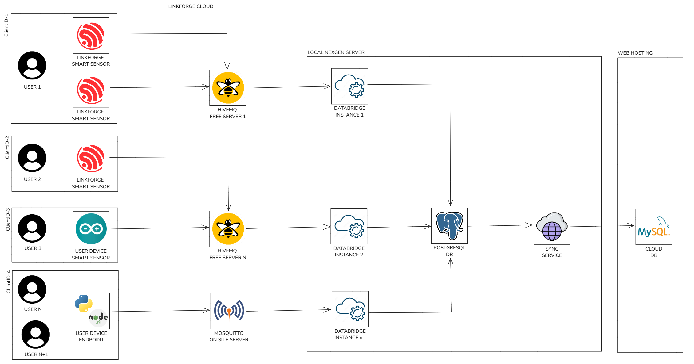

# LinkForge
LinkForge es un entorno IoT basado en ESP32, MQTT y TypeScript. Desde sensores DIY hasta microservicios para publicar, procesar y visualizar datos en tiempo real. Fácil de desplegar, ligero en recursos y escalable a nivel profesional. ¡Colabora con nosotros!

## Arquitectura

## SmartSensor

En LinkForge estamos construyendo una base sólida de sensores IoT pensados para cubrir distintos escenarios de uso, iniciando con prototipos DIY buscando crear implementaciones profesionales.

Actualmente, el desarrollo se centra en:

- Código fuente modular para soportar diferentes tipos de sensores.

- Diseño de hardware en colaboración con un equipo de ingenieros electrónicos que trabajan en los PCBs dedicados.

- Todos los sensores se basan en variantes del ESP32, seleccionadas según las necesidades del proyecto:

    - Bajo consumo de energía.

    - Intervalos de medición configurables.

    - Conectividad flexible vía WiFi o red de datos.

Próximamente estarán disponibles los archivos de fabricación para que la comunidad pueda armar, probar y mejorar los sensores de manera abierta y colaborativa.

